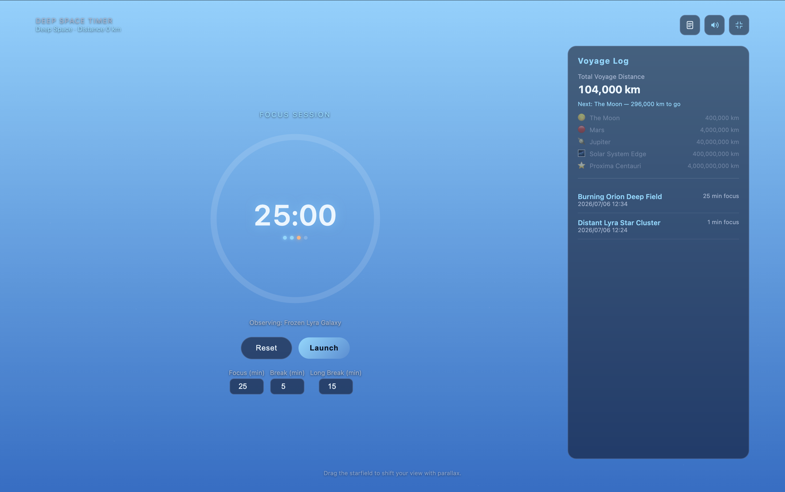

# Deep Space Pomodoro Timer

**[▶ Try it live](https://pomodoro-timer-eight-pi.vercel.app)**

A Pomodoro timer that turns every focus session into a voyage into deep space.
The sky darkens as you concentrate, stars emerge one by one, and each completed
session is recorded in your voyage log as another few million kilometers traveled.



*Before launch you are still at the surface. As the focus session runs, the sky
darkens into deep space and the stars come out.*

Built as a **single `index.html` file** — no build step, no dependencies, no tracking.
Open it in a browser and you are ready to launch.

## Features

### Focus as a journey
- **Depth-driven starfield** — a seeded canvas star map that fades from bright
  atmosphere blue into near-black deep space as the session progresses.
- **A new sky every session** — stars, nebula, and comet are generated from a fresh
  seed each focus session, so no two voyages look alike.
- **Named observations** — every session is assigned a procedurally generated target
  such as *Whispering Orion Nebula* or *Frozen Lyra Star Cluster*.
- **Voyage log & milestones** — completed focus time accumulates into a lifetime
  odometer, unlocking the Moon, Mars, Jupiter, the Solar System Edge, and Proxima Centauri.

### A proper Pomodoro
- Configurable focus / short break / long break durations (defaults: 25 / 5 / 15 min).
- Automatic long break every 4th focus session, with cycle dots showing your position.
- State is persisted to `localStorage`, and elapsed time is recalculated after a reload
  so the timer never silently freezes.

### Platform-aware behavior
| Platform | Behavior |
| --- | --- |
| Mobile / touch | Haptic feedback via the Vibration API, including escalating "thruster" pulses near session end |
| macOS | Drag the starfield to shift your view with parallax |
| Windows | Hover any star for a depth/magnitude readout |
| All | Web Notifications, Screen Wake Lock, Fullscreen, and a synthesized Web Audio chime |

Notifications, wake lock, fullscreen, and vibration are all feature-detected —
unsupported controls are hidden rather than left dead.

## Getting started

```bash
git clone https://github.com/hugesesame/pomodoro-timer.git
cd pomodoro-timer
open index.html        # macOS — or just double-click the file
```

Any modern browser works. For Notification and Wake Lock APIs to be available,
serve it over `http://localhost` or HTTPS rather than `file://`:

```bash
python3 -m http.server 8000
# then open http://localhost:8000
```

## Tech

Vanilla HTML, CSS, and JavaScript. No frameworks, no bundler, no npm install.

- `<canvas>` + `requestAnimationFrame` for the starfield
- Mulberry32 seeded PRNG for deterministic, reproducible skies
- Web Audio API for the completion chime (synthesized, slightly detuned each time)
- `localStorage` for timer state, voyage log, and lifetime distance
- Notification / Wake Lock / Fullscreen / Vibration APIs, all feature-detected
- Responsive: bottom-sheet modal on mobile, side panel on desktop, with safe-area insets

## Privacy

Everything stays in your browser. No accounts, no servers, no analytics —
your voyage log lives only in your own `localStorage`.

## License

MIT
